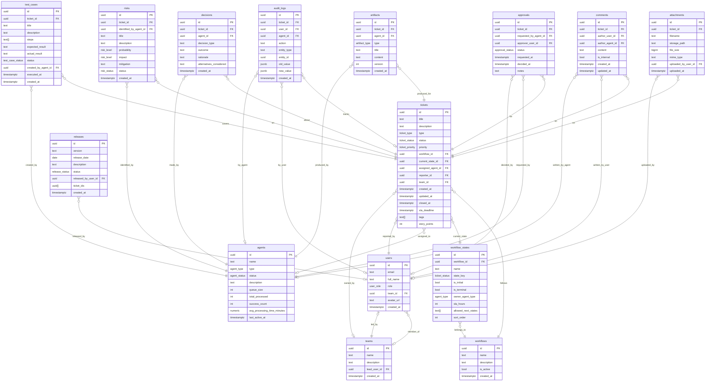
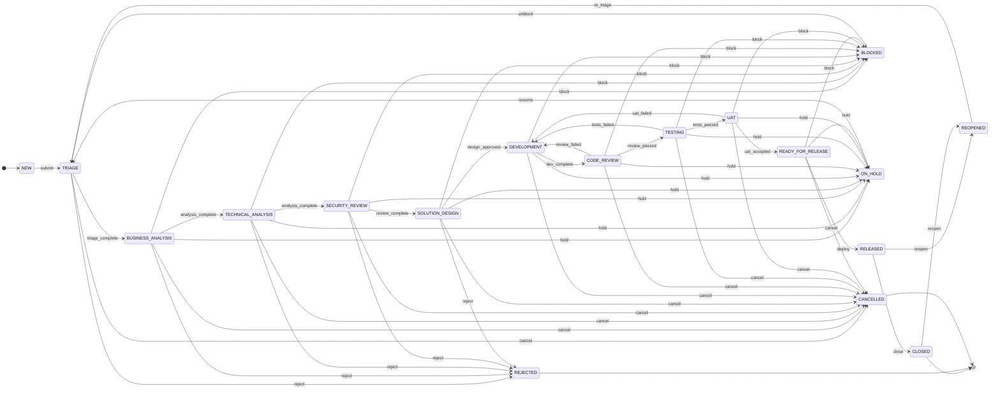

# AgentitDevelopmentTool — Architecture

## Overview

AgentitDevelopmentTool is a ticketing platform where each ticket (Bug / Feature / Change / Epic / Story / Task) passes through a defined workflow and is automatically handed off between specialized AI agents. Each agent owns one or more workflow states and is responsible for producing structured artifacts, raising risks, requesting approvals, and transitioning the ticket to the next state. Human users interact primarily through reviews, approvals, and UAT; all other lifecycle activity is agent-driven.

---

## Entity Relationship Diagram

---

## Ticket State Machine

---

## Complete Entity Specifications

### tickets

| Field | Type | Notes |
|---|---|---|
| id | uuid | Primary key |
| title | text | Short summary |
| description | text | Full description / acceptance criteria |
| type | ticket_type | BUG \| FEATURE \| CHANGE \| EPIC \| STORY \| TASK |
| status | ticket_status | Current workflow state |
| priority | ticket_priority | CRITICAL \| HIGH \| MEDIUM \| LOW |
| workflow_id | uuid | FK → workflows |
| current_state_id | uuid | FK → workflow_states |
| assigned_agent_id | uuid | FK → agents (nullable) |
| reporter_id | uuid | FK → users |
| team_id | uuid | FK → teams (nullable) |
| created_at | timestamptz | |
| updated_at | timestamptz | |
| closed_at | timestamptz | Nullable |
| sla_deadline | timestamptz | Computed from workflow_state.sla_hours |
| tags | text[] | Free-form labels |
| story_points | int | Estimation; nullable |

---

### workflows

| Field | Type | Notes |
|---|---|---|
| id | uuid | Primary key |
| name | text | e.g. "Standard Software Delivery" |
| description | text | |
| is_active | bool | Only one active workflow enforced at app layer |
| created_at | timestamptz | |

---

### workflow_states

| Field | Type | Notes |
|---|---|---|
| id | uuid | Primary key |
| workflow_id | uuid | FK → workflows |
| name | text | Display label |
| state_key | ticket_status | Maps to enum value |
| is_initial | bool | Entry point of the workflow |
| is_terminal | bool | No further transitions expected |
| owner_agent_type | agent_type | Which agent type is responsible |
| sla_hours | int | Hours allowed in this state before SLA breach |
| allowed_next_states | text[] | Permitted ticket_status transitions |
| sort_order | int | Visual ordering |

---

### agents

| Field | Type | Notes |
|---|---|---|
| id | uuid | Primary key |
| name | text | Display name |
| type | agent_type | See enum |
| status | agent_status | ACTIVE \| IDLE \| BUSY \| OFFLINE |
| description | text | Role description |
| queue_size | int | Current pending tickets |
| total_processed | int | Lifetime count |
| success_count | int | Completed without rejection |
| avg_processing_time_minutes | numeric | Rolling average |
| last_active_at | timestamptz | |

---

### users

| Field | Type | Notes |
|---|---|---|
| id | uuid | FK → auth.users (Supabase Auth) |
| email | text | Unique |
| full_name | text | |
| role | user_role | ADMIN \| MANAGER \| DEVELOPER \| VIEWER |
| team_id | uuid | FK → teams (nullable) |
| avatar_url | text | Nullable |
| created_at | timestamptz | |

---

### teams

| Field | Type | Notes |
|---|---|---|
| id | uuid | Primary key |
| name | text | |
| description | text | |
| lead_user_id | uuid | FK → users (nullable) |
| created_at | timestamptz | |

---

### comments

| Field | Type | Notes |
|---|---|---|
| id | uuid | Primary key |
| ticket_id | uuid | FK → tickets |
| author_user_id | uuid | FK → users (nullable — one of user/agent) |
| author_agent_id | uuid | FK → agents (nullable — one of user/agent) |
| content | text | Markdown supported |
| is_internal | bool | Hidden from external stakeholders when true |
| created_at | timestamptz | |
| updated_at | timestamptz | |

---

### attachments

| Field | Type | Notes |
|---|---|---|
| id | uuid | Primary key |
| ticket_id | uuid | FK → tickets |
| filename | text | Original filename |
| storage_path | text | Object storage key |
| file_size | bigint | Bytes |
| mime_type | text | |
| uploaded_by_user_id | uuid | FK → users |
| uploaded_at | timestamptz | |

---

### artifacts

| Field | Type | Notes |
|---|---|---|
| id | uuid | Primary key |
| ticket_id | uuid | FK → tickets |
| agent_id | uuid | FK → agents |
| type | artifact_type | ANALYSIS \| SPEC \| CODE \| TEST_REPORT \| SECURITY_REPORT \| ARCHITECTURE \| DEPLOYMENT_PLAN |
| title | text | |
| content | text | Markdown or structured JSON |
| version | int | Incremented on update |
| created_at | timestamptz | |

---

### approvals

| Field | Type | Notes |
|---|---|---|
| id | uuid | Primary key |
| ticket_id | uuid | FK → tickets |
| requested_by_agent_id | uuid | FK → agents |
| approver_user_id | uuid | FK → users (nullable until decided) |
| status | approval_status | PENDING \| APPROVED \| REJECTED \| EXPIRED |
| requested_at | timestamptz | |
| decided_at | timestamptz | Nullable |
| notes | text | Decision rationale; nullable |

---

### decisions

| Field | Type | Notes |
|---|---|---|
| id | uuid | Primary key |
| ticket_id | uuid | FK → tickets |
| agent_id | uuid | FK → agents |
| decision_type | text | e.g. "architecture_selection", "risk_acceptance" |
| outcome | text | The chosen option |
| rationale | text | Agent reasoning |
| alternatives_considered | text | JSON or prose |
| created_at | timestamptz | |

---

### risks

| Field | Type | Notes |
|---|---|---|
| id | uuid | Primary key |
| ticket_id | uuid | FK → tickets |
| identified_by_agent_id | uuid | FK → agents |
| title | text | |
| description | text | |
| probability | risk_level | LOW \| MEDIUM \| HIGH \| CRITICAL |
| impact | risk_level | LOW \| MEDIUM \| HIGH \| CRITICAL |
| mitigation | text | Proposed mitigation steps |
| status | risk_status | OPEN \| MITIGATED \| ACCEPTED \| CLOSED |
| created_at | timestamptz | |

---

### test_cases

| Field | Type | Notes |
|---|---|---|
| id | uuid | Primary key |
| ticket_id | uuid | FK → tickets |
| title | text | |
| description | text | |
| steps | text[] | Ordered list of test steps |
| expected_result | text | |
| actual_result | text | Populated after execution; nullable |
| status | test_case_status | PENDING \| PASS \| FAIL \| BLOCKED \| SKIPPED |
| created_by_agent_id | uuid | FK → agents |
| executed_at | timestamptz | Nullable |
| created_at | timestamptz | |

---

### releases

| Field | Type | Notes |
|---|---|---|
| id | uuid | Primary key |
| version | text | Semantic version, e.g. "2.4.1" |
| release_date | date | Planned or actual |
| description | text | Release notes |
| status | release_status | PLANNED \| IN_PROGRESS \| RELEASED \| FAILED \| CANCELLED |
| released_by_user_id | uuid | FK → users (nullable) |
| ticket_ids | uuid[] | Denormalized list of included ticket IDs |
| created_at | timestamptz | |

---

### audit_logs

| Field | Type | Notes |
|---|---|---|
| id | uuid | Primary key |
| ticket_id | uuid | FK → tickets (nullable — some actions are system-wide) |
| user_id | uuid | FK → users (nullable) |
| agent_id | uuid | FK → agents (nullable) |
| action | text | e.g. "status_changed", "comment_added" |
| entity_type | text | Table name of the affected entity |
| entity_id | uuid | PK of the affected row |
| old_value | jsonb | Previous state snapshot |
| new_value | jsonb | New state snapshot |
| created_at | timestamptz | |

---

## Enums

### ticket_type
| Value | Description |
|---|---|
| BUG | Defect or regression |
| FEATURE | New capability request |
| CHANGE | Modification to existing functionality |
| EPIC | Large body of work spanning multiple stories |
| STORY | User-facing narrative unit of work |
| TASK | Technical or administrative work item |

### ticket_status
| Value | Phase |
|---|---|
| NEW | Initial creation |
| TRIAGE | Product Owner assessment |
| BUSINESS_ANALYSIS | Business Analyst elaboration |
| TECHNICAL_ANALYSIS | IT Analyst feasibility |
| SECURITY_REVIEW | Security Analyst gate |
| SOLUTION_DESIGN | Solution Architect design |
| DEVELOPMENT | Developer implementation |
| CODE_REVIEW | Code Reviewer gate |
| TESTING | QA Tester verification |
| UAT | User Acceptance Testing |
| READY_FOR_RELEASE | DevOps staging approval |
| RELEASED | Production deployed |
| CLOSED | Lifecycle complete |
| BLOCKED | External dependency |
| REJECTED | Declined at any gate |
| ON_HOLD | Temporarily paused |
| REOPENED | Returned after close |
| CANCELLED | Abandoned |

### ticket_priority
`CRITICAL` · `HIGH` · `MEDIUM` · `LOW`

### agent_type
| Value | Owns State(s) |
|---|---|
| PRODUCT_OWNER | TRIAGE |
| BUSINESS_ANALYST | BUSINESS_ANALYSIS |
| IT_ANALYST | TECHNICAL_ANALYSIS |
| SECURITY_ANALYST | SECURITY_REVIEW |
| SOLUTION_ARCHITECT | SOLUTION_DESIGN |
| DEVELOPER | DEVELOPMENT |
| CODE_REVIEWER | CODE_REVIEW |
| QA_TESTER | TESTING, UAT |
| DEVOPS | READY_FOR_RELEASE |
| RELEASE_MANAGER | RELEASED → CLOSED |

### agent_status
`ACTIVE` · `IDLE` · `BUSY` · `OFFLINE`

### artifact_type
`ANALYSIS` · `SPEC` · `CODE` · `TEST_REPORT` · `SECURITY_REPORT` · `ARCHITECTURE` · `DEPLOYMENT_PLAN`

### approval_status
`PENDING` · `APPROVED` · `REJECTED` · `EXPIRED`

### risk_level
`LOW` · `MEDIUM` · `HIGH` · `CRITICAL`

### risk_status
`OPEN` · `MITIGATED` · `ACCEPTED` · `CLOSED`

### test_case_status
`PENDING` · `PASS` · `FAIL` · `BLOCKED` · `SKIPPED`

### release_status
`PLANNED` · `IN_PROGRESS` · `RELEASED` · `FAILED` · `CANCELLED`

### user_role
| Value | Access level |
|---|---|
| ADMIN | Full platform access, user management |
| MANAGER | Team management, approval authority |
| DEVELOPER | Create/update tickets, comment, attach |
| VIEWER | Read-only access |

---

## Pages and Routes

| Route | Component | Description |
|---|---|---|
| `/` | Redirect | → `/dashboard/management` |
| `/login` | AuthPage | Supabase Auth UI — email/password + OAuth |
| `/tickets` | TicketList | Filterable, sortable table with status badges and SLA indicators |
| `/tickets/new` | TicketCreateForm | Ticket type selector, fields, workflow assignment |
| `/tickets/:id` | TicketDetail | Tabbed view: Overview, Comments, Artifacts, Risks, Test Cases, Approvals, Audit Log |
| `/agents` | AgentGrid | Card grid showing all agents with status, queue size, and performance metrics |
| `/agents/:id` | AgentDetail | Agent profile: live queue, processed ticket history, artifact list, performance charts |
| `/workflows` | WorkflowVisualization | Interactive state diagram with SLA overlays; per-state agent assignment |
| `/teams` | TeamManagement | CRUD for teams; member list; workload summary per team |
| `/releases` | ReleaseList | Table of releases with status; drill-down to included tickets |
| `/dashboard/management` | ManagementDashboard | KPI cards: open tickets by type/priority, SLA breach rate, cycle time, agent throughput |
| `/dashboard/team` | TeamDashboard | Per-team workload distribution, open vs closed, velocity chart |
| `/dashboard/agent` | AgentPerformanceDashboard | Per-agent: queue depth, avg processing time, success rate, artifact output volume |

### Route Protection

All routes except `/login` require an authenticated session. Role-based guards:

- `VIEWER` — read-only access to all routes except `/teams` (hidden) and `/workflows` (read-only).
- `DEVELOPER` — full ticket CRUD; cannot manage teams or workflows.
- `MANAGER` — all developer permissions + team management + approval authority.
- `ADMIN` — unrestricted; user management included.
